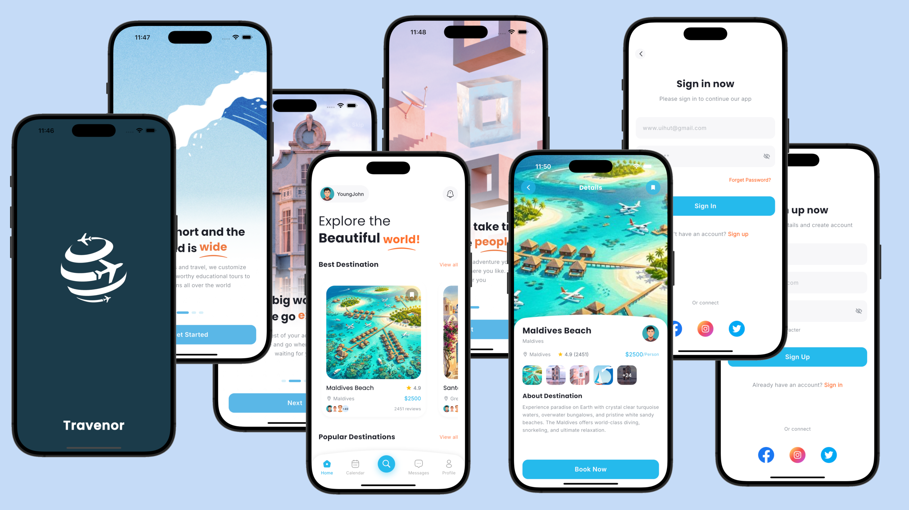
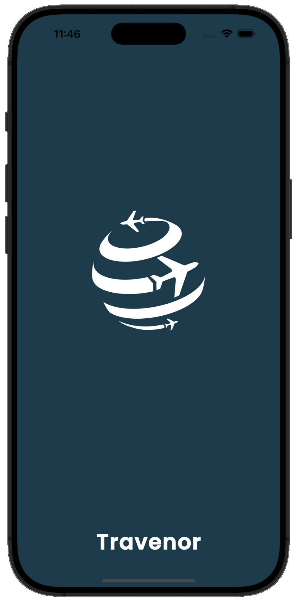
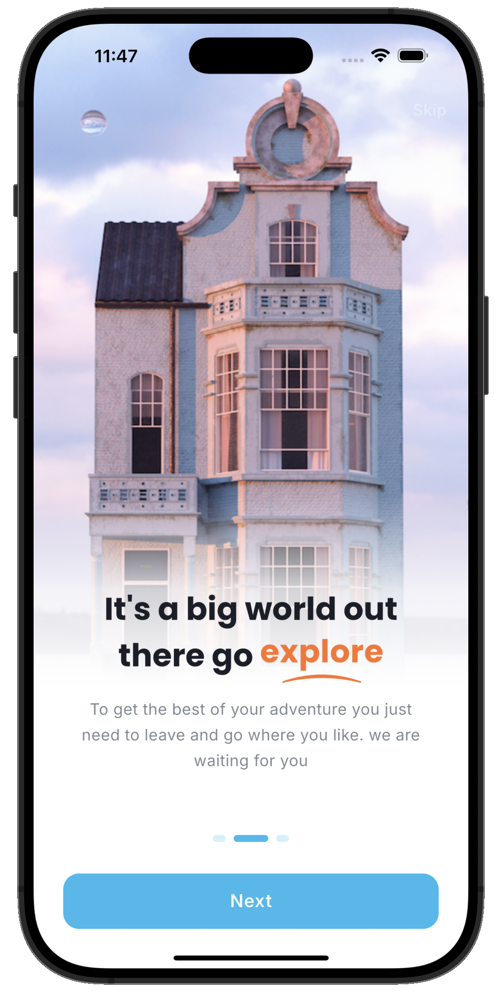
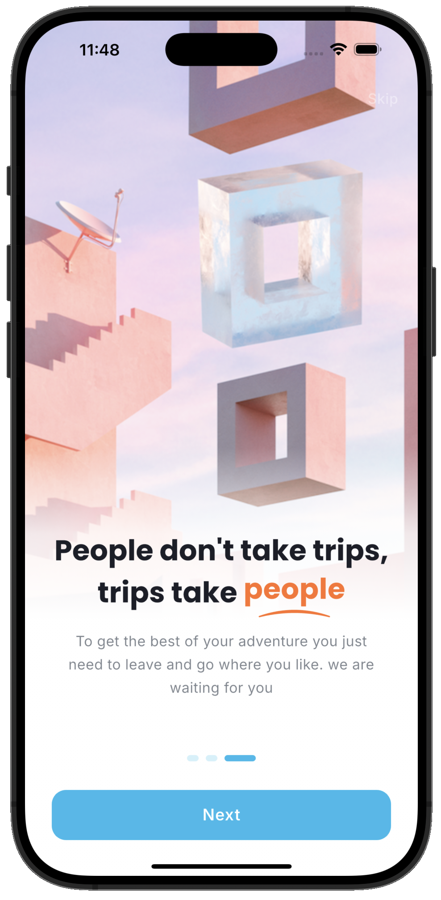
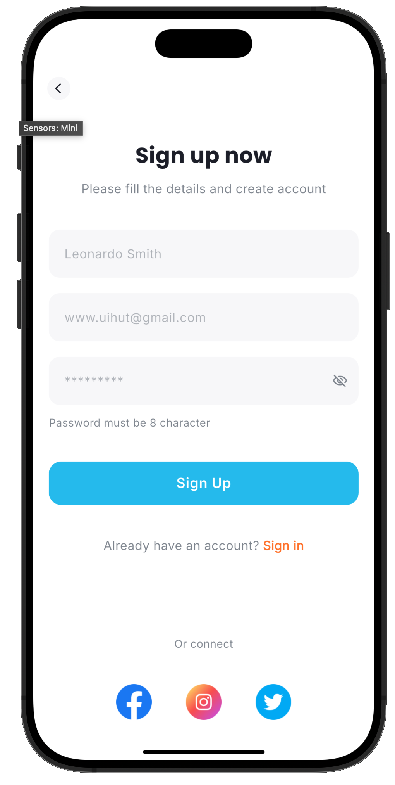
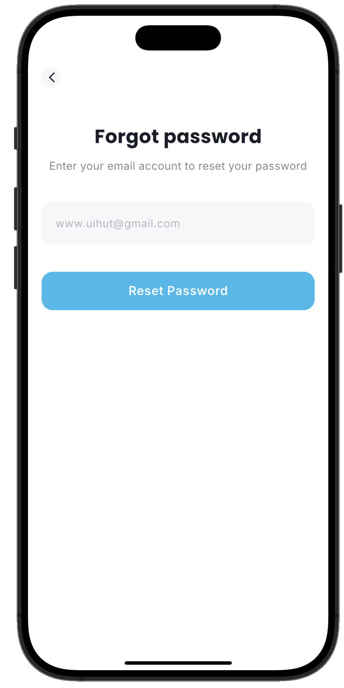
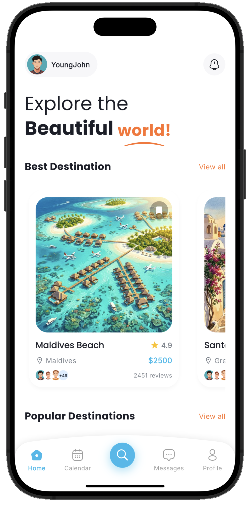
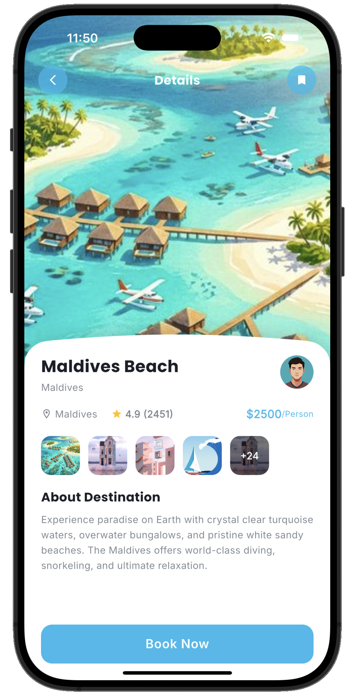

# Travenor - Travel App UI

<div align="center">



**A beautifully crafted travel app UI built with Flutter**

[](https://flutter.dev)
[](https://dart.dev)
[](LICENSE)

[Features](#-features) • [Screenshots](#-screenshots) • [Installation](#-installation) • [Architecture](#-architecture) • [Technologies](#-technologies)

</div>

---

## Overview

**Travenor** is a modern travel application UI/UX implementation built entirely with Flutter. This project showcases beautiful, responsive design patterns and smooth animations without any backend logic implementation. It serves as an excellent reference for building polished mobile interfaces.

> **Note**: This is a UI-only implementation. No backend services, authentication, or data persistence logic is included.

---

## Features

### Design Highlights
- **Custom Painters** - Hand-crafted shapes using Flutter's CustomPainter API
- **Premium Aesthetics** - Glassmorphism, gradients, and modern color schemes
- **Responsive Layout** - Adapts seamlessly to different screen sizes
- **Smooth Animations** - Subtle micro-interactions and transitions
- **Custom Navigation** - Unique bottom navigation bar with curved design

### Implemented Screens
| Screen | Description |
|--------|-------------|
| **Splash** | Animated brand introduction with logo |
| **Onboarding** | 3-page carousel showcasing app features |
| **Sign In** | Clean authentication interface |
| **Sign Up** | User registration form |
| **Forgot Password** | Password recovery flow |
| **OTP Verification** | Code input with auto-navigation |
| **Home** | Destination listings with categories |
| **Details** | Full destination info with custom bottom sheet |
| **Map View** | Location-based destination view |
| **Schedule** | Trip planning interface |

---

## Screenshots

<div align="center">

### Onboarding Flow
| Splash | Onboarding 1 | Onboarding 2 | Onboarding 3 |
|:------:|:------------:|:------------:|:------------:|
|  |  |  |  |

### Authentication
| Sign In | Sign Up | Forgot Password | OTP Sent |
|:-------:|:-------:|:---------------:|:--------:|
|  |  |  |  |

### Main App
| Home Screen | Details Screen |
|:-----------:|:--------------:|
|  |  |

</div>

---

## Installation

### Prerequisites
- Flutter SDK `^3.9.0`
- Dart SDK `^3.0.0`
- iOS Simulator / Android Emulator / Physical Device

### Setup

```bash
# Clone the repository
git clone https://github.com/yourusername/travenor.git

# Navigate to project directory
cd travenor

# Install dependencies
flutter pub get

# Run the app
flutter run
```

---

## Architecture

```
lib/
├── core/                    # Core utilities and shared components
│   ├── router/              # GoRouter navigation configuration
│   │   └── app_router.dart
│   ├── theme/               # App-wide styling
│   │   ├── app_colors.dart
│   │   └── app_text_styles.dart
│   └── widgets/             # Reusable widgets
│       └── highlighted_word.dart
├── data/                    # Data layer
│   └── mock_destinations.dart
├── models/                  # Data models
│   ├── destination.dart
│   └── rating.dart
├── screens/                 # Feature screens
│   ├── auth/                # Authentication screens
│   │   ├── forgot_password_screen.dart
│   │   ├── otp_verification_screen.dart
│   │   ├── sign_in_screen.dart
│   │   └── sign_up_screen.dart
│   ├── details/             # Destination details
│   │   ├── details_screen.dart
│   │   └── widgets/
│   ├── home/                # Home screen
│   ├── main/                # Main shell with navigation
│   ├── map/                 # Map view
│   ├── onboarding/          # Onboarding flow
│   │   ├── onboarding_screen.dart
│   │   └── widgets/
│   ├── schedule/            # Trip scheduling
│   └── splash/              # Splash screen
└── main.dart                # App entry point
```

---

## Technologies

| Package | Purpose |
|---------|---------|
| **go_router** | Declarative routing and navigation |
| **flutter_riverpod** | State management (structure ready) |
| **google_fonts** | Custom typography (Poppins, Inter) |
| **iconsax_plus** | Modern icon set |
| **flutter_svg** | SVG asset rendering |

---

## Design System

### Color Palette
| Color | Hex | Usage |
|-------|-----|-------|
| Primary Teal | `#0DCEDA` | Buttons, highlights |
| Accent Orange | `#FF7028` | CTAs, favorites |
| Background | `#F6F6F6` | App background |
| Text Primary | `#1B1E28` | Headlines |
| Text Secondary | `#7D848D` | Body text |

### Typography
- **Headings**: Poppins (Bold, 24-36px)
- **Body**: Inter (Regular, 14-16px)
- **Buttons**: Inter (SemiBold, 16px)

---

## Assets Structure

```
assets/
├── images/                  # Raster images
│   ├── destinations/        # Destination photos (14 images)
│   ├── onboarding_1.png
│   ├── onboarding_2.png
│   ├── onboarding_3.png
│   └── ...
└── svg/                     # Vector graphics
    └── logo.svg
```

---

## Contributing

Contributions are welcome! Feel free to:
1. Fork the repository
2. Create a feature branch (`git checkout -b feature/amazing-feature`)
3. Commit changes (`git commit -m 'Add amazing feature'`)
4. Push to branch (`git push origin feature/amazing-feature`)
5. Open a Pull Request

---

## License

This project is licensed under the MIT License - see the [LICENSE](LICENSE) file for details.

---

## Acknowledgments

- Design inspiration from various Dribbble concepts
- Flutter team for the amazing framework
- Open source community for the packages used

---

<div align="center">

**Made with Flutter**

</div>
